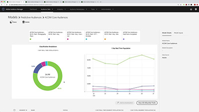

# Audience Manager-zelfstudies

Welkom bij de website van Audience Manager voor zelfstudies. Het gebruiken van deze leerprogramma&#39;s samen met de [ documentatie ](https://experienceleague.adobe.com/docs/audience-manager/user-guide/aam-home.html) zal u een beter begrip geven hoe te om Adobe Audience Manager te gebruiken om publiek op om het even welk kanaal of apparaat tot stand te brengen en te activeren gebruikend Adobe best-in-klasse [!DNL data management platform].

* **benadrukt enkele van onze favoriete inhoud van de Pictogrammen van het Personeel**
* Onderzoek de inhoud door onderwerp en subtopic in de **linkernavigatie**
* Gebruik het **onderzoek** gebied bij de bovenkant van de pagina als u weet wat u zoekt

## Personeelsselectie

<table>
<tr>
  <td>
    
    

      <a href="https://experienceleague.adobe.com/docs/platform-learn/implement-web-sdk/overview.html">
    <strong> voer Adobe Experience Cloud met het leerprogramma van SDK van het Web uit </strong>
    </a>
    

    

    <em> leer hoe te om de toepassingen van Experience Cloud uit te voeren gebruikend het Web SDK van Adobe Experience Platform.</em>
    

  </td>
  <td>
    
    

      <a href="https://experienceleague.adobe.com/docs/audience-manager-learn/tutorials/other-integrations/integrating-with-rtcdp/rtcdp-segments-for-aam-users.html">
    <strong> Begrijpend Segmenten in real time CDP voor de Gebruikers van Audience Manager </strong>
    </a>
    

    

    <em> Deze video kijkt naar de verschillen in segmenten en segmentverwezenlijking tussen Audience Manager en Real-time CDP.</em>
    

  </td>
  <td>
    
    

      <a href="https://experienceleague.adobe.com/docs/audience-manager-learn/tutorials/build-and-manage-audiences/algorithmic-models/configure-and-report-on-predictive-audiences.html">
    <strong> vormt en rapporteert over Voorspelend publiek in Audience Manager </strong>
    </a>
    

    

    <em> In deze video, zullen wij door de Predictieve configuratie van het Publiek in de interface van Audience Manager lopen.</em>
    

  </td>
</tr>
</table>

