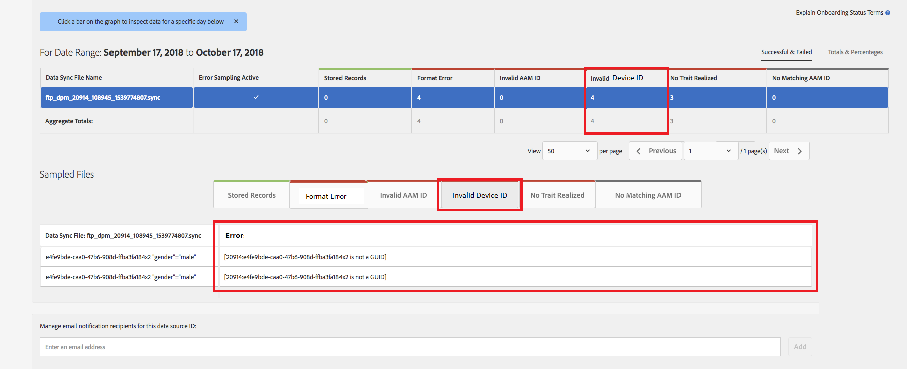

# Algemene validatie van apparaat-id {#global-device-id-validation}

Device Advertising-id&#39;s (iDFA, GAID, Roku-id) hebben opmaakstandaarden die moeten worden nageleefd om te kunnen worden gebruikt in het ecosysteem voor digitale reclame. Vandaag, kunnen de klanten en de partners IDs aan onze Globale gegevensbronnen in om het even welk formaat uploaden zonder op de hoogte worden gebracht van of identiteitskaart behoorlijk geformatteerd is. Deze functie introduceert validatie van apparaat-id&#39;s die naar de algemene gegevensbronnen worden verzonden voor een correcte opmaak en geeft foutberichten wanneer id&#39;s onjuist zijn opgemaakt. Validatie voor [!DNL iDFA] , [!DNL Google Advertising] en [!DNL Roku IDs] wordt ondersteund bij het starten.

## Overzicht van opmaakstandaarden {#overview-of-format-standards}

Hieronder vindt u de algemene Advertising-id-pools voor apparaten die momenteel worden herkend en ondersteund door AAM. Deze worden geïmplementeerd als gedeelde [!UICONTROL Data Sources] die kan worden gebruikt door elke klant of gegevenspartner die werkt met gegevens die zijn gekoppeld aan gebruikers van deze platforms.

<table>
  <tr>
   <td>Platform </td>
   <td>AAM Data Source ID </td>
   <td>ID-indeling </td>
   <td>AAM PID </td>
   <td>Notities </td>
  </tr>
  <tr>
   <td>Google Android (GAID)</td>
   <td>20914</td>
   <td>32 hexadecimale aantallen, over het algemeen voorgesteld als 8-4-4-4-12 <em> voorbeeld, 97987bca-ae59-4c7d-94ba-ee4f19ab8c21   </em> </td>
   <td>1352</td>
   <td>Deze identiteitskaart moet in een ruwe/onveranderd/onveranderd vormVerwijzing worden verzameld - <a href="https://play.google.com/about/monetization-ads/ads/ad-id/"> https://play.google.com/about/monetization-ads/ads/ad-id/ </a></td>
  </tr>
  <tr>
   <td>Apple iOS (IDFA)</td>
   <td>20915</td>
   <td>32 hexadecimale aantallen, over het algemeen voorgesteld als 8-4-4-4-12 <em> voorbeeld, 6D92078A-8246-4BA4-AE5B-76104861E7DC   </em> </td>
   <td>3560</td>
   <td>Deze identiteitskaart moet in een ruwe/onveranderd/onveranderd vormVerwijzing worden verzameld - <a href="https://support.apple.com/en-us/HT205223"> https://support.apple.com/en-us/HT205223 </a></td>
  </tr>
  <tr>
   <td>Roku</td>
   <td>121963</td>
   <td>32 hexadecimale aantallen, over het algemeen voorgesteld als 8-4-4-4-12 <em> voorbeeld, </em> <em> fcb2a29c-315a-5e6b-bcfd-d889ba19aada </em></td>
   <td>11536</td>
   <td>Deze identiteitskaart moet in een ruwe/onveranderd/onveranderd vormVerwijzing worden verzameld - <a href="https://sdkdocs.roku.com/display/sdkdoc/Roku+Advertising+Framework"> https://sdkdocs.roku.com/display/sdkdoc/Roku+Advertising+Framework </a> </td>
  </tr>
  <tr>
   <td>Microsoft Advertising-ID (MAID)</td>
   <td>389146</td>
   <td>Alpha numerieke string</td>
   <td>14593</td>
   <td>Deze identiteitskaart moet in een onbewerkte/onveranderde vormverwijzing worden verzameld - <a href="https://docs.microsoft.com/en-us/uwp/api/windows.system.userprofile.advertisingmanager.advertisingid"> https://docs.microsoft.com/en-us/uwp/api/windows.system.userprofile.advertisingmanager.advertisingid </a>  <a href="https://msdn.microsoft.com/en-us/library/windows/apps/windows.system.userprofile.advertisingmanager.advertisingid.aspx"> https://msdn.microsoft.com/en-us/library/windows/apps/windows.system.userprofile.advertisingmanager.advertisingid.aspx </a></td>
  </tr>
  <tr>
   <td>Samsung DUID</td>
   <td>404660</td>
   <td>Alpha numeriek string voorbeeld, 7XCBNROQJQPYW</td>
   <td>15950</td>
   <td>Deze identiteitskaart moet in een ruwe/onveranderd/onveranderd vormVerwijzing worden verzameld - <a href="https://developer.samsung.com/tv/develop/api-references/samsung-product-api-references/productinfo-api"> https://developer.samsung.com/tv/develop/api-references/samsung-product-api-references/productinfo-api </a> </td>
  </tr>
</table>

## Een Advertising-id instellen in de app {#setting-an-advertising-identifier-in-the-app}

Het instellen van de adverteerder-id in de app is eigenlijk twee stappen: eerst de adverteerder-id ophalen en vervolgens naar de Experience Cloud verzenden. Hieronder vindt u koppelingen voor het uitvoeren van deze stappen.

1. De id ophalen
   1. [!DNL Apple] de informatie over [!DNL advertising ID] kan [&#128279;](https://developer.apple.com/documentation/adsupport/asidentifiermanager) HER worden gevonden.
   1. Sommige informatie over het plaatsen van [!DNL advertiser ID] voor [!DNL Android] ontwikkelaars kan [ HER ](http://android.cn-mirrors.com/google/play-services/id.html) worden gevonden.
1. Verzend het naar de Experience Cloud met de methode [!DNL setAdvertisingIdentifier] in de SDK
   1. De informatie voor het gebruiken van `setAdvertisingIdentifier` is in de [ documentatie ](https://aep-sdks.gitbook.io/docs/using-mobile-extensions/mobile-core/identity/identity-api-reference#set-an-advertising-identifier) voor zowel [!DNL iOS] als [!DNL Android].

`// iOS (Swift) example for using setAdvertisingIdentifier:`
`ACPCore.setAdvertisingIdentifier([AdvertisingId]) // ...where [AdvertisingId] is replaced by the actual advertising ID`

## DCS-foutbericht voor onjuiste id&#39;s  {#dcs-error-messaging-for-incorrect-ids}

Wanneer een onjuiste globale apparaat-id (IDFA, GAID, enz.) in real time naar Audience Manager wordt verzonden, wordt een foutcode geretourneerd bij de hit. Hieronder ziet u een voorbeeld van een fout die wordt geretourneerd omdat de id wordt verzonden als een [!DNL Apple IDFA] . Deze mag alleen hoofdletters bevatten. De id bevat echter een kleine letter &#39;x&#39;.

Gelieve te zien de [ documentatie ](https://experienceleague.adobe.com/docs/audience-manager/user-guide/api-and-sdk-code/dcs/dcs-api-reference/dcs-error-codes.html?lang=en#api-and-sdk-code) voor de lijst van foutencodes.

## Algemene apparaat-id&#39;s aan boord {#onboarding-global-device-ids}

Naast real time voorlegging van Globale Apparaat IDs, kunt u ook &quot;[!DNL onboard] &quot;- (upload) gegevens tegen IDs eveneens. Dit proces is het zelfde als wanneer u gegevens tegen uw klant IDs (typisch via sleutel/waardeparen) opneemt, maar u zou eenvoudig de juiste Gegevens Source IDs gebruiken, zodat de gegevens aan globale apparatenidentiteitskaart worden toegewezen. De documentatie over het aan boord gaan proces kan in de [ documentatie ](https://experienceleague.adobe.com/docs/audience-manager/user-guide/implementation-integration-guides/sending-audience-data/batch-data-transfer-process/batch-data-transfer-overview.html?lang=en#implementation-integration-guides) worden gevonden. Denk eraan dat u de globale gegevensbron-id wilt gebruiken, afhankelijk van het platform dat u gebruikt.

Als onjuiste globale apparaat IDs door het onboarding proces wordt voorgelegd, zullen de fouten in [[!DNL Onboarding Status Report] ](https://experienceleague.adobe.com/docs/audience-manager/user-guide/reporting/onboarding-status-report.html?lang=en#reporting) tonen.

Hieronder ziet u een voorbeeld van een fout die in dat rapport wordt vermeld:

