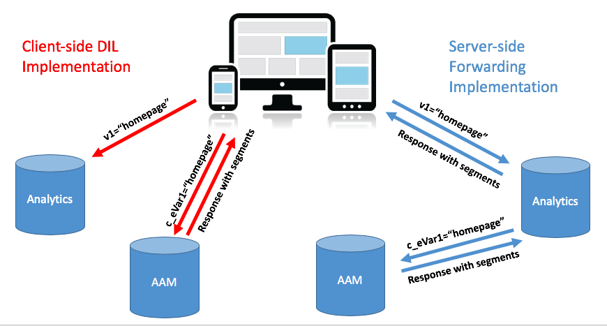

# De Audience Manager-implementatie van uw site migreren van client-side DIL naar server-side forward {#migrating-your-site-s-aam-implementation-from-client-side-dil-to-server-side-forwarding}

Deze zelfstudie is op u van toepassing als u zowel Adobe Audience Manager (AAM) als Adobe Analytics hebt en u momenteel een hit van de pagina naar AAM verzendt met DIL-code ([!DNL Data Integration Library] ) en ook een hit van de pagina naar Adobe Analytics verzendt. Aangezien u beide oplossingen hebt, en aangezien zij allebei deel van Adobe Experience Cloud uitmaken, hebt u de kans om de beste praktijk te volgen om server-zij het door:sturen aan te zetten, die de [!DNL Analytics] servers van de gegevensinzameling toelaat om plaats analysegegevens in real time aan Audience Manager door te sturen, in plaats van het hebben van cliënt-zijcode een extra klap van de pagina naar AAM verzendt. Dit leerprogramma begeleidt u door de stappen om de schakelaar van de oudere cliënt-kant implementatie van DIL aan de nieuwere server-kant door:sturen methode te maken.

## Client-kant (DIL) versus server-kant {#client-side-dil-vs-server-side}

Bij het vergelijken en contrasteren van deze twee methoden om Adobe Analytics-gegevens in AAM te plaatsen, kan het in de eerste plaats nuttig zijn om de verschillen in de volgende afbeelding te visualiseren:

### DIL-implementatie op de client {#client-side-dil-implementation}

Als u deze methode gebruikt om Adobe Analytics-gegevens in AAM te krijgen, komen er twee hits van uw webpagina&#39;s: een gaat naar [!DNL Analytics] en een gaat naar AAM (nadat u de [!DNL Analytics] -gegevens op de webpagina hebt gekopieerd). [!UICONTROL Segments] wordt geretourneerd van AAM naar de pagina, waar ze kunnen worden gebruikt voor personalisatie, enzovoort. Dit wordt beschouwd als een oudere implementatie en wordt niet meer aanbevolen.

Afgezien van het feit dat dit niet de beste praktijken volgt, omvatten de nadelen om deze methode te gebruiken:

* Twee treffers komen van de pagina in plaats van slechts één
* server-side het door:sturen wordt vereist voor het in real time delen van het publiek van AAM aan [!DNL Analytics], zodat de cliënt-zijimplementaties voor deze eigenschap (en potentieel andere eigenschappen in de toekomst niet toestaan)

Men adviseert dat u zich aan een server-kant het door:sturen methode van de implementatie van AAM beweegt.

### Server-kant het door:sturen implementatie {#server-side-forwarding-implementation}

Zoals in bovenstaande afbeelding wordt getoond, komt een hit van de webpagina naar Adobe Analytics. [!DNL Analytics] stuurt die gegevens vervolgens door naar AAM in real-time, en bezoekers worden beoordeeld op AAM-kenmerken en [!UICONTROL segments] , net alsof de treffer rechtstreeks van de pagina afkomstig was.

[!UICONTROL Segments] worden op dezelfde real-time hit geretourneerd als [!DNL Analytics] , die de reactie doorstuurt naar de webpagina voor personalisatie, enzovoort.

Er is geen timing aan het bewegen naar server-kant door:sturen. Adobe raadt iedereen die zowel Audience Manager als [!DNL Analytics] heeft, ten zeerste aan deze implementatiemethode te gebruiken.

## U hebt twee hoofdtaken {#you-have-two-main-tasks}

Er staat nogal wat informatie op deze pagina, en dat is natuurlijk allemaal belangrijk. Nochtans, stuitert het **allen neer aan twee belangrijkste dingen die u** moet doen:

1. Wijzig uw code van client-side DIL-code in server-side door:sturen-code
1. Draai de schakelaar in [!DNL Analytics] [!DNL Admin Console] om het daadwerkelijke door:sturen van gegevens (per [!UICONTROL report suite]) te beginnen

Als u één van beiden van deze taken overslaat, server-kant door:sturen zal niet correct werken. Er zijn stappen en aanvullende gegevens toegevoegd aan dit document, zodat u deze twee stappen correct kunt uitvoeren.

## Implementatieopties {#implementation-options}

Aangezien u zich van cliënt-kant aan server-kant het door:sturen beweegt, één van de taken u zult hebben verandert de code aan de nieuwe server-kant door:sturen code. Dit gebeurt op basis van een van de volgende opties:

* Adobe Experience Platform-tags - door Adobe aanbevolen implementatieoptie voor webeigenschappen. U zult zien dat dit een gemakkelijke taak is, aangezien de tags Platform al het harde werk voor u hebben gedaan.
* Op de pagina - U kunt de nieuwe SWF-code ook rechtstreeks in de functie `doPlugins` in uw `appMeasurement.js` -bestand plaatsen als u (nog) geen Adobe Launch gebruikt
* Andere tagmanagers - Deze kunnen op dezelfde manier worden behandeld als de vorige optie (Op de pagina), aangezien u de SSF-code toch in `doPlugins` plaatst, waar de andere tagmanager de [!DNL AppMeasurement] -code opslaat

Wij zullen elk van deze hieronder in _bekijken Bijwerkend de code_ sectie.

## Implementatiestappen {#implementation-steps}

In de volgende stappen wordt de implementatie beschreven.

### Stap 0: Vereiste: Experience Cloud ID Service (ECID) {#step-prerequisite-experience-cloud-id-service-ecid}

De belangrijkste voorwaarde voor de overgang naar server-kant door:sturen is dat de Experience Cloud ID Service wordt geïmplementeerd. Dit is het gemakkelijkst gedaan als u de Lancering van het Platform van de Ervaring gebruikt, waarbij u eenvoudig de uitbreiding ECID installeert en het de rest zal doen.

Als u niet-Adobe TMS, of geen TMS bij allen gebruikt, dan gelieve ECID uit te voeren **vóór** om het even welke andere oplossingen van Adobe in werking te stellen. Zie de [ documentatie ECID ](https://experienceleague.adobe.com/docs/id-service/using/home.html) voor meer details. De enige andere voorwaarde is betreffende codeversies, zodat aangezien u eenvoudig de meest recente versies van de code in de volgende stappen toepast, zult u in orde zijn.

>[!NOTE]
>
>Lees dit gehele document voordat u het implementeert. De sectie &quot;Timing&quot;heeft hieronder belangrijke informatie over *wanneer* u elk stuk, met inbegrip van ECID (als het nog niet wordt uitgevoerd) zou moeten uitvoeren.

### Stap 1: Neem de momenteel gebruikte opties op van de code van DIL {#step-record-currently-used-options-from-dil-code}

Aangezien u bereid wordt om zich van cliënt-kant DIL code aan server-kant door:sturen, is de eerste stap alles te identificeren dat u met de code van DIL doet, met inbegrip van douanemontages en gegevens die naar AAM worden verzonden. U kunt onder andere de volgende dingen opmerken en overwegen:

* Normale variabelen [!DNL Analytics] met de module `siteCatalyst.init` DIL - U hoeft zich geen zorgen te maken over deze module, omdat het alleen maar gaat om het verzenden van de normale variabelen [!DNL Analytics] . Dat gebeurt door het eenvoudig doorsturen van de server in te schakelen.
* Partner Subdomain - noteer de parameter `DIL.create` in de functie `partner` . Dit is gekend als uw &quot;partner subdomain,&quot;of soms &quot;partner identiteitskaart,&quot;en zal nodig zijn wanneer u de nieuwe server-kant het door:sturen code plaatst.
* [!DNL Visitor Service Namespace] - ook gekend als uw &quot;[!DNL Org ID]&quot;of &quot;[!DNL IMS Org ID],&quot;u zult dit eveneens nodig hebben wanneer u opstelling de nieuwe server-kant het door:sturen code. Noteer dit.
* containerNSID, uuidCookie, en andere geavanceerde opties - maak een nota van om het even welke extra geavanceerde opties u gebruikt zodat u hen in de server-zij het door:sturen code kunt plaatsen eveneens.
* Aanvullende paginabariabelen - Als andere variabelen vanaf de pagina naar AAM worden verzonden (naast de normale [!DNL Analytics] -variabelen die door siteCatalyst.init worden verwerkt), moet u hiervan nota nemen zodat ze via server-side forward kunnen worden verzonden (spoiler alert: via [!DNL contextData] -variabelen).

### Stap 2: De code bijwerken {#step-updating-the-code}

In [ de opties van de Implementatie ](#implementation-options) (hierboven), worden de veelvoudige opties gegeven betreffende hoe en waar u server-kant het door:sturen uitvoert. Om deze paragraaf doeltreffend te maken, moeten we ze in deze secties opsplitsen (met twee gecombineerd). Ga naar de methode van deze sectie die uw behoeften het best beschrijft.

#### Adobe Experience Platform-tags {#launch-by-adobe}

Bekijk de video hieronder voor meer informatie over het verplaatsen van implementatieopties van DIL-code aan de clientzijde naar server-side forward in Experience Platform Launch.

>[!VIDEO](https://video.tv.adobe.com/v/26310/?quality=12)

#### &quot;Op de pagina&quot; of niet-Adobe tagmanager {#on-the-page-or-non-adobe-tag-manager}

Bekijk de video hieronder voor meer informatie over het verplaatsen van implementatieopties van DIL-code op de client naar-code op de server in [!DNL AppMeasurement] -code, die zich in een bestand of in een niet-Adobe-tagbeheersysteem bevindt.

>[!VIDEO](https://video.tv.adobe.com/v/26312/?quality=12)

### Stap 3: Het door:sturen (per [!UICONTROL Report Suite]) toelaten {#step-enabling-the-forwarding-per-report-suite}

Tot dusver in deze zelfstudie hebben we al onze tijd besteed aan het overschakelen van de code van client-side DIL code naar server-side door:sturen. Dat is prima, want het is het moeilijkste. Hoewel u zult zien dat deze sectie bijzonder eenvoudig is, is deze net zo belangrijk als het bijwerken van de code. In deze video, zult u zien hoe te om de schakelaar te draaien die het daadwerkelijke door:sturen van gegevens van Analytics aan Audience Manager toelaat.

>[!VIDEO](https://video.tv.adobe.com/v/26355/?quality-12)

**NOTA:** Zoals verklaard in de video, herinner dat het tot 4 uren voor het toelaten van het door:sturen zal duren om volledig op Experience Cloud achterste worden uitgevoerd.

## Timing {#timing}

Ter herinnering, zijn er twee belangrijke taken om zich over van cliënt-kant DIL aan server-kant door:sturen:

1. De code bijwerken
1. De schakelaar omdraaien in de [!DNL Analytics] [!DNL Admin Console]

Maar de vraag is: welke doe je eerst? Maakt het uit? Dat waren twee vragen. Maar de antwoorden zijn... het hangt af, en ja, kan het ** ertoe doen. Hoe is dat voor vaag? Laten we het splitsen. Maar eerst een aanvullende vraag die je kunt stellen als je een grote organisatie bent met veel sites: Moet ik alles tegelijk doen? Dat is iets makkelijker. Nope. Je kunt het stuk voor stuk doen.

### Een beetje dieper duiken {#a-little-deeper-dive}

De reden waarom timing en orde materie wegens is hoe het door:sturen __ echt werkt, die in de volgende weinig technische feiten kan worden samengevat:

* Als u de Experience Cloud ID Service (ECID) hebt geïmplementeerd en de schakelaar in [!DNL Analytics] [!DNL Admin Console] (&quot;de switch&quot;) is ingeschakeld, sturen gegevens door van [!DNL Analytics] naar AAM, zelfs als u de code nog niet hebt bijgewerkt.
* Als u ECID niet hebt uitgevoerd, zullen de gegevens niet door:sturen, zelfs als u de schakelaar hebt, en de server-kant hebben door:sturen code.
* De server-kant het door:sturen code (of in de markeringen van het Platform of op de pagina) behandelt werkelijk de reactie en is noodzakelijk om de migratie te voltooien.
* De door:sturen switch aan de serverzijde wordt ingeschakeld door [!UICONTROL report suite] , maar de code wordt afgehandeld door de eigenschap in Platform-tags of door het [!DNL AppMeasurement] -bestand als u geen Platform-tags gebruikt.

### Aanbevolen procedures {#best-practices}

Op basis van deze technische details zijn hier de aanbevelingen voor de timing van wat te doen en wanneer:

#### Als u ECID nog niet hebt geïmplementeerd {#if-you-do-not-have-ecid-yet-implemented}

1. Draai de schakelaar in [!DNL Analytics] voor elke [!UICONTROL report suite] die u voor server-zij door:sturen zult toelaten.

   1. Het doorsturen begint nog niet omdat u geen ECID hebt.

1. Werk per site uw code bij van client-side DIL naar server-side door:sturen (dit kan in Platform-tags staan) of op de pagina, zoals in een andere sectie hierboven is beschreven).

   1. Door:sturen nu stromen (aangezien u ECID) hebt toegevoegd, en u zou ook een juiste reactie JSON op uw [!DNL Analytics] baken moeten ontvangen (zie de sectie van de Bevestiging en van het Oplossen van problemen hieronder voor meer details).

#### Als u ECID hebt geïmplementeerd {#if-you-do-have-ecid-implemented}

1. Bereid en plan zodat u bereid bent om uw code van DIL aan server-kant door:sturen PER [!UICONTROL report suite] bij te werken die u voor server-kant het door:sturen zult toelaten:

   1. Draai de schakelaar binnen [!DNL Analytics] om server-kant het door:sturen toe te laten.

      1. Het doorsturen begint omdat je ECID hebt ingeschakeld.

   1. Werk uw code zo snel mogelijk bij van client-side DIL naar single-side forward (dit kan in Platform-tags of op de pagina staan, zoals in een andere sectie hierboven is beschreven).

      1. U zou een juiste reactie JSON op uw [!DNL Analytics] baken (zie de [ Bevestiging en het oplossen van problemensectie ](#validation-and-troubleshooting) hieronder voor meer details) moeten ontvangen.

>[!NOTE]
>
>Het is belangrijk om deze twee stappen zo dicht mogelijk bij elkaar te doen, omdat u tussen stap 1 en 2 hierboven dubbele gegevens hebt die naar AAM gaan. Met andere woorden, single-side door:sturen zal gegevens van [!DNL Analytics] naar AAM zijn begonnen te verzenden. Aangezien de DIL-code nog steeds op de pagina staat, zal er ook een hit zijn die rechtstreeks van de pagina naar AAM gaat, waardoor de gegevens worden verdubbeld. Zodra u de code van DIL aan server-kant door:sturen bijwerkt, zal dit worden verlicht.

>[!NOTE]
>
>Als u liever een kleine discrepantie in gegevens hebt in plaats van een kleine duplicatie van gegevens, kunt u de volgorde van stap 1 en 2 hierboven wijzigen. Als u de code van DIL naar server-side door:sturen verplaatst, wordt de gegevensstroom naar AAM gestopt totdat u de switch kunt spiegelen om het door:sturen van de server voor [!UICONTROL report suite] in te schakelen. Klanten hebben doorgaans liever een kleine verdubbeling van de gegevens dan bezoekers in de trottoirs en [!UICONTROL segments] te missen.

#### Tijdstip voor migratie wanneer u veel sites hebt en [!UICONTROL report suites] {#migration-timing-when-you-have-many-sites-and-report-suites}

Dit onderwerp wordt in eerdere paragrafen kort besproken, in die zin dat de hoofdstrategie als volgt kan worden samengevat:

Migreer één plaats/[!UICONTROL report suite] (of groep plaatsen/[!UICONTROL report suites]) tegelijkertijd.

Nochtans, kan dit een beetje lastig worden gebaseerd op een paar mogelijke scenario&#39;s:

* U hebt een site die verschillende verschillende onderdelen bevat [!UICONTROL report suites]
* U hebt een [!UICONTROL report suite] die meerdere sites bevat (zoals een algemene [!UICONTROL report suite] )
* U gebruikt één eigenschap Platform-tags voor meerdere sites
* U hebt verschillende ontwikkelingsteams voor verschillende sites

Vanwege deze items kan het een beetje ingewikkeld worden. De beste dingen die ik kan voorstellen zijn:

* Neem wat tijd om een strategie te maken voor het migreren naar server-kant het door:sturen, die op de dingen wordt gebaseerd die hierboven zijn verklaard
* Gebaseerd op het feit dat één enkele bezit in de markeringen van het Platform (of één enkel [!DNL AppMeasurement] dossier) typisch aan 1 of 2 verschillend [!UICONTROL report suites] toewijst, zult u waarschijnlijk een plan kunnen maken dat aan deze verschillende groepen één voor één werkt, die uw onderneming aan server-kant door:sturen
* Als u met Adobe Consulting werkt, praat dan met hen over uw migratieplan, zodat ze daar waar nodig hulp kunnen bieden

## Validatie en probleemoplossing {#validation-and-troubleshooting}

De belangrijkste manier om te bevestigen dat de server-kant het door:sturen in werking is door de reactie op om het even welk van uw Adobe Analytics klappen te bekijken die uit app komen.

Als u geen server-side het door:sturen van gegevens van [!DNL Analytics] aan Audience Manager doet, dan is er echt geen reactie op het [!DNL Analytics] baken (behalve een 2 pixel). Nochtans, als u server-kant het door:sturen doet, dan zijn er punten die u in het [!DNL Analytics] verzoek en de reactie kunt verifiëren die u zullen laten weten dat [!DNL Analytics] correct met Audience Manager communiceert, door:sturen de slag, en het krijgen van een reactie.

>[!VIDEO](https://video.tv.adobe.com/v/26359/?quality=12)

>[!WARNING]
>
>Let op de fout &quot;Succes&quot;. Als er een reactie is en alles lijkt te werken, controleert u of u het object `stuff` in de reactie hebt. Als u dat niet doet, ziet u mogelijk een bericht met de tekst `"status":"SUCCESS"` . Hoe gek dit ook klinkt, dit is eigenlijk een bewijs dat het NIET correct werkt.
>
>Als u dit ziet, betekent dit dat u de code-update in Platform-tags of [!DNL AppMeasurement] hebt voltooid, maar dat het doorsturen in de [!DNL Analytics] [!DNL Admin Console] nog niet is voltooid. In dit geval moet u controleren of u het doorsturen aan de serverzijde hebt ingeschakeld in de lus [!DNL Analytics] [!DNL Admin Console] for your [!UICONTROL report suite] . Als je wel, en dat is nog geen 4 uur, geduld hebt, omdat het zo lang kan duren om alle noodzakelijke veranderingen op de achtergrond te maken.

Voor meer informatie over server-kant door:sturen, gelieve de [ documentatie ](https://experienceleague.adobe.com/docs/analytics/admin/admin-tools/server-side-forwarding/ssf.html) te zien.
